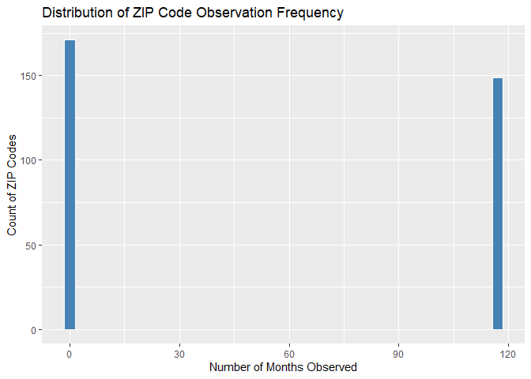
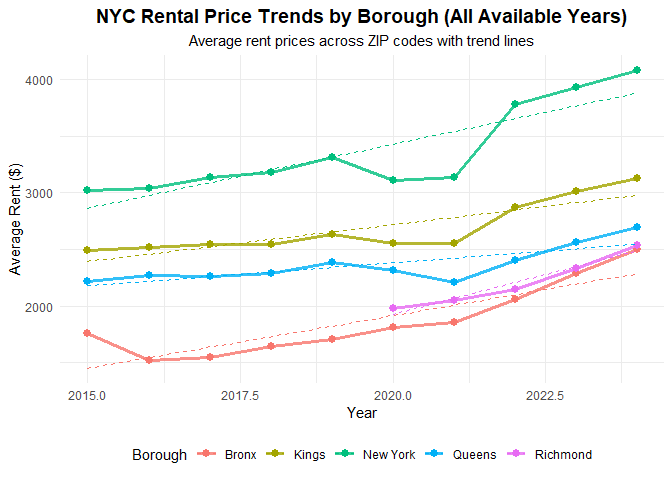
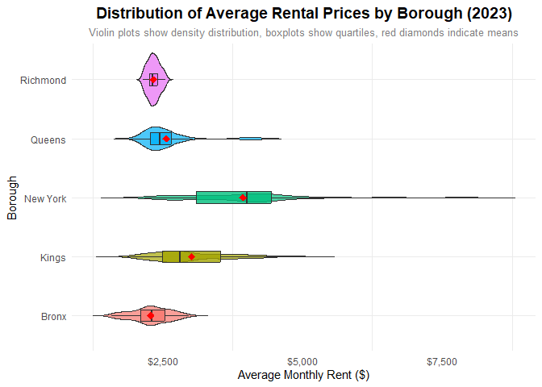
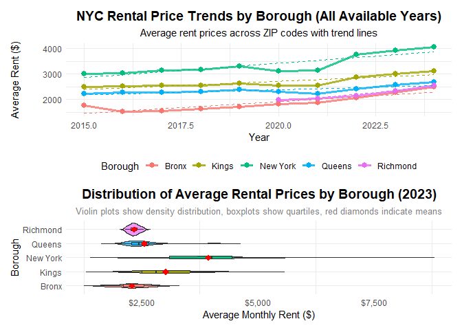
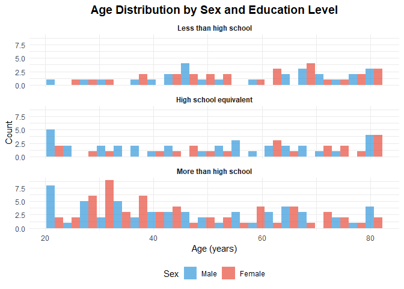
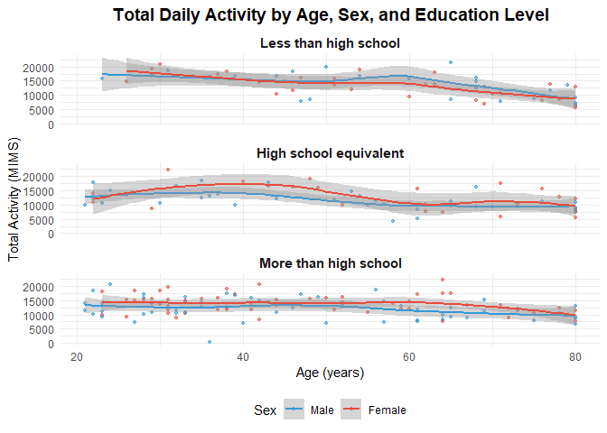
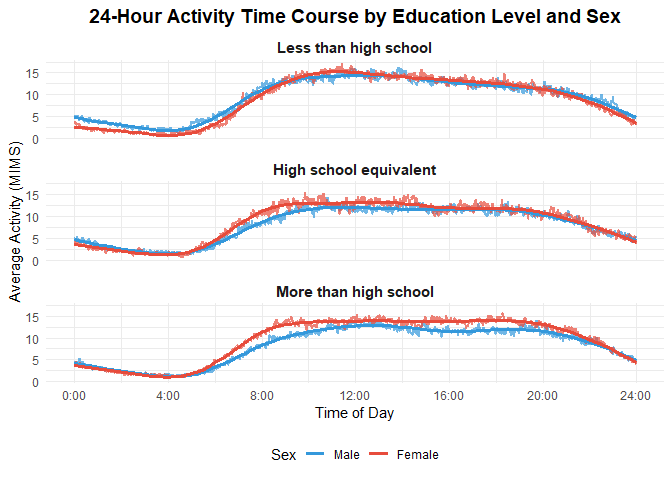

p8105_hw3_LC4052
================
2025-10-06

``` r
library(tidyverse)
```

    ## ── Attaching core tidyverse packages ──────────────────────── tidyverse 2.0.0 ──
    ## ✔ dplyr     1.1.4     ✔ readr     2.1.5
    ## ✔ forcats   1.0.0     ✔ stringr   1.5.2
    ## ✔ ggplot2   3.5.2     ✔ tibble    3.3.0
    ## ✔ lubridate 1.9.4     ✔ tidyr     1.3.1
    ## ✔ purrr     1.1.0     
    ## ── Conflicts ────────────────────────────────────────── tidyverse_conflicts() ──
    ## ✖ dplyr::filter() masks stats::filter()
    ## ✖ dplyr::lag()    masks stats::lag()
    ## ℹ Use the conflicted package (<http://conflicted.r-lib.org/>) to force all conflicts to become errors

``` r
library(ggridges)
library(patchwork)
library(dplyr)
library(ggplot2)
```

# Problem 1

## Import data

``` r
library(p8105.datasets)
data("instacart")
```

## Description of variables

The dataset includes1384617 observations and 15 variables, including
order_id, product_id, add_to_cart_order, reordered, user_id, eval_set,
order_number, order_dow, order_hour_of_day, days_since_prior_order,
product_name, aisle_id, department_id, aisle, department.

There are 39123 distinct product ids and 39123 product names.
Departments contain dairy eggs, produce, canned goods, beverages, deli,
snacks, pantry, frozen, meat seafood, household, bakery, personal care,
dry goods pasta, babies, missing, other, breakfast, international,
alcohol, bulk, pets.

## Number of aisles

``` r
instacart |>
  count(aisle) |>
  arrange(desc(n)) |>
  slice(1) |>
  pull(aisle)
```

    ## [1] "fresh vegetables"

There are 134 aisles. “fresh vegetables” are the most items ordered
from.

## Plot of the number of items ordered in each aisle

``` r
instacart |>
  count(aisle) |>
  filter(n > 10000) |>
  ggplot(aes(x = reorder(aisle, n), y = n)) +
  geom_col(fill = "steelblue", alpha = 0.8) +
  coord_flip() +
  labs(
    title = "Number of Items Ordered in Each Aisle",
    subtitle = "Aisles with more than 10,000 items ordered",
    x = "Aisle",
    y = "Number of Items Ordered"
  ) +
  theme_minimal() +
  scale_y_continuous(labels = scales::comma)
```

<!-- -->

## Table of the three most popular items

``` r
instacart |>
  filter(aisle %in% c("baking ingredients", "dog food care", "packaged vegetables fruits")) |>
  group_by(aisle, product_name) |>
  summarise(order_count = n()) |>
  group_by(aisle) |>
  slice_max(order_count, n = 3) |>
  arrange(aisle, desc(order_count))
```

    ## `summarise()` has grouped output by 'aisle'. You can override using the
    ## `.groups` argument.

    ## # A tibble: 9 × 3
    ## # Groups:   aisle [3]
    ##   aisle                      product_name                            order_count
    ##   <chr>                      <chr>                                         <int>
    ## 1 baking ingredients         Light Brown Sugar                               499
    ## 2 baking ingredients         Pure Baking Soda                                387
    ## 3 baking ingredients         Cane Sugar                                      336
    ## 4 dog food care              Snack Sticks Chicken & Rice Recipe Dog…          30
    ## 5 dog food care              Organix Chicken & Brown Rice Recipe              28
    ## 6 dog food care              Small Dog Biscuits                               26
    ## 7 packaged vegetables fruits Organic Baby Spinach                           9784
    ## 8 packaged vegetables fruits Organic Raspberries                            5546
    ## 9 packaged vegetables fruits Organic Blueberries                            4966

## Table of the mean hour

``` r
instacart |>
  filter(product_name %in% c("Pink Lady Apples", "Coffee Ice Cream")) |>
  mutate(
    day_of_week = factor(order_dow,
                       levels = 0:6,
                       labels = c("Sunday", "Monday", "Tuesday", "Wednesday",
                                  "Thursday", "Friday", "Saturday")),
    hour_of_day = order_hour_of_day
  ) |>
  group_by(product_name, day_of_week) |>
  summarize(mean_hour = round(mean(hour_of_day), 1)) |>
  pivot_wider(
    names_from = day_of_week,
    values_from = mean_hour
  )
```

    ## `summarise()` has grouped output by 'product_name'. You can override using the
    ## `.groups` argument.

    ## # A tibble: 2 × 8
    ## # Groups:   product_name [2]
    ##   product_name     Sunday Monday Tuesday Wednesday Thursday Friday Saturday
    ##   <chr>             <dbl>  <dbl>   <dbl>     <dbl>    <dbl>  <dbl>    <dbl>
    ## 1 Coffee Ice Cream   13.8   14.3    15.4      15.3     15.2   12.3     13.8
    ## 2 Pink Lady Apples   13.4   11.4    11.7      14.2     11.6   12.8     11.9

# Problem 2

## Import and clean data

``` r
# Import data
zipcodes_df = 
  read_csv("./zillow_data/Zip Codes.csv",
             na = c("NA", ".", "")) |>
  janitor::clean_names() |>
  select(county,zip_code, everything())
```

    ## Rows: 322 Columns: 7
    ## ── Column specification ────────────────────────────────────────────────────────
    ## Delimiter: ","
    ## chr (3): County, File Date, Neighborhood
    ## dbl (4): State FIPS, County Code, County FIPS, ZipCode
    ## 
    ## ℹ Use `spec()` to retrieve the full column specification for this data.
    ## ℹ Specify the column types or set `show_col_types = FALSE` to quiet this message.

``` r
# Clean the zip_codes file
zipcodes_df = 
  read_csv("./zillow_data/Zip Codes.csv",
             na = c("NA", ".", "")) |>
  janitor::clean_names() |>
  select(county,zip_code, everything(), -file_date)
```

    ## Rows: 322 Columns: 7
    ## ── Column specification ────────────────────────────────────────────────────────
    ## Delimiter: ","
    ## chr (3): County, File Date, Neighborhood
    ## dbl (4): State FIPS, County Code, County FIPS, ZipCode
    ## 
    ## ℹ Use `spec()` to retrieve the full column specification for this data.
    ## ℹ Specify the column types or set `show_col_types = FALSE` to quiet this message.

``` r
names(zipcodes_df)
```

    ## [1] "county"       "zip_code"     "state_fips"   "county_code"  "county_fips" 
    ## [6] "neighborhood"

``` r
# Clean the zip_zori file
zori_df = 
  read_csv("./zillow_data/Zip_zori_uc_sfrcondomfr_sm_month_NYC.csv",
             na = c("NA", ".", "")) |>
  pivot_longer(
    cols = 10 : 125,
    names_to = "file_date", 
    values_to = "rent_price") |>
    mutate(file_date = as.character(file_date)) |>
  rename(county = CountyName, zip_code = RegionName) |>                       
  mutate(county = sub(" County$", "", county)) |> 
  arrange(zip_code) |>
  select(county,zip_code,file_date, rent_price, everything())
```

    ## Rows: 149 Columns: 125
    ## ── Column specification ────────────────────────────────────────────────────────
    ## Delimiter: ","
    ## chr   (6): RegionType, StateName, State, City, Metro, CountyName
    ## dbl (119): RegionID, SizeRank, RegionName, 2015-01-31, 2015-02-28, 2015-03-3...
    ## 
    ## ℹ Use `spec()` to retrieve the full column specification for this data.
    ## ℹ Specify the column types or set `show_col_types = FALSE` to quiet this message.

``` r
# Combine data
combined_data = 
  full_join(zipcodes_df, zori_df, by = c("county","zip_code")) |>
  select(county,zip_code,file_date, rent_price, neighborhood, everything())

names(combined_data)
```

    ##  [1] "county"       "zip_code"     "file_date"    "rent_price"   "neighborhood"
    ##  [6] "state_fips"   "county_code"  "county_fips"  "RegionID"     "SizeRank"    
    ## [11] "RegionType"   "StateName"    "State"        "City"         "Metro"

## number of ZIP codes

``` r
combined_data |>
  count(zip_code)|>
  filter(n == 116) |>
  nrow()
```

    ## [1] 146

``` r
combined_data |>
  count(zip_code)|>
  filter(n < 10) |>
  nrow()
```

    ## [1] 171

146 ZIP codes are observed 116 times. 171 ZIP codes are observed fewer
than 10 times.

## Frequency differences of ZIP codes

``` r
zip_freq =
  combined_data |>
  mutate(file_date = as.Date(file_date)) |>
  group_by(zip_code) |>
  summarize(
    n_months = n_distinct(format(file_date, "%Y-%m")),
    zip_count = n()
  )

ggplot(zip_freq, aes(x = n_months)) +
  geom_histogram(binwidth = 3, fill = "steelblue", color = "white") +
  labs(
    title = "Distribution of ZIP Code Observation Frequency",
    x = "Number of Months Observed",
    y = "Count of ZIP Codes"
  )
```

<!-- -->

High-frequency ZIP codes might benefit from dense populations that
generate continuous rental market activity throughout the data
collection period. They may be also due to better technological coverage
and more reliable reporting mechanisms.

## Table showing the average rental price in each borough and year

``` r
borough_rent =
  combined_data |>
  mutate(
    file_date = as.Date(file_date),
    year = year(file_date)
  ) |>
  group_by(county, year) |>
  summarize(
    zip_count = n(),
    avg_rent = mean(rent_price, na.rm = TRUE)
  ) |>
  arrange(county, year)
```

    ## `summarise()` has grouped output by 'county'. You can override using the
    ## `.groups` argument.

``` r
borough_rent
```

    ## # A tibble: 55 × 4
    ## # Groups:   county [5]
    ##    county  year zip_count avg_rent
    ##    <chr>  <dbl>     <int>    <dbl>
    ##  1 Bronx   2015       264    1760.
    ##  2 Bronx   2016       264    1520.
    ##  3 Bronx   2017       264    1544.
    ##  4 Bronx   2018       264    1639.
    ##  5 Bronx   2019       264    1706.
    ##  6 Bronx   2020       264    1811.
    ##  7 Bronx   2021       264    1858.
    ##  8 Bronx   2022       264    2054.
    ##  9 Bronx   2023       264    2285.
    ## 10 Bronx   2024       176    2497.
    ## # ℹ 45 more rows

The average rent of each borough increased with years. The rent in
Manhattan borough remained relatively high. Zip code counts on 2024 were
less than the ones on other years.

## Plot showing NYC Rental Prices within ZIP codes for all available years

``` r
nyc_rent =
  combined_data |>
  mutate(
    file_date = as.Date(file_date),
    year = year(file_date)
  ) |>
  filter(!is.na(county) & !is.na(rent_price)) |>
  group_by(county, year) |>
  summarize(
    avg_rent = mean(rent_price, na.rm = TRUE),
    n_zip_codes = n_distinct(zip_code)
  ) |>
  ggplot(aes(x = year, y = avg_rent, color = county)) +
  geom_line(size = 1.2, alpha = 0.8) +
  geom_point(size = 2.5) +
  geom_smooth(method = "lm", se = FALSE, linetype = "dashed", size = 0.5, alpha = 0.5) +
  labs(
    title = "NYC Rental Price Trends by Borough (All Available Years)",
    subtitle = "Average rent prices across ZIP codes with trend lines",
    x = "Year",
    y = "Average Rent ($)",
    color = "Borough"
  ) +
  theme_minimal() +
  scale_x_continuous() +
  theme(
    legend.position = "bottom",
    plot.title = element_text(face = "bold", size = 14, hjust = 0.5),
    plot.subtitle = element_text(hjust = 0.5)
  )
```

    ## `summarise()` has grouped output by 'county'. You can override using the
    ## `.groups` argument.

    ## Warning: Using `size` aesthetic for lines was deprecated in ggplot2 3.4.0.
    ## ℹ Please use `linewidth` instead.
    ## This warning is displayed once every 8 hours.
    ## Call `lifecycle::last_lifecycle_warnings()` to see where this warning was
    ## generated.

``` r
print(nyc_rent)
```

    ## `geom_smooth()` using formula = 'y ~ x'

<!-- -->
The plot reveals that all five boroughs have experienced rental price
increases over the eight-year window. The rent prices in Manhattan
maintained higher than other areas throughout the entire period, while
the ones in Bronx remained the lowest.

The COVID-19 pandemic period (2020-2021) represents a disruption to
established trends, with all boroughs experiencing either rental price
declines or significant growth deceleration. Manhattan appears to have
been most affected.

## Plot showing the distribution of ZIP-code-level rental prices across boroughs

``` r
rent_2023 =
  combined_data |>
  mutate(
    file_date = as.Date(file_date),
    year = lubridate::year(file_date),
    month = lubridate::month(file_date, label = TRUE)
  ) |>
  filter(year == 2023) |>
  group_by(zip_code, county, month) |>
  summarize(
    avg_rent = mean(rent_price, na.rm = TRUE)
  )
```

    ## `summarise()` has grouped output by 'zip_code', 'county'. You can override
    ## using the `.groups` argument.

``` r
borough_comparison_plot =
  rent_2023 |>
  ggplot(aes(x = county, y = avg_rent, fill = county)) +
  geom_violin(alpha = 0.7, trim = FALSE) +
  geom_boxplot(width = 0.2, alpha = 0.8, outlier.shape = NA) +
  stat_summary(fun = mean, geom = "point", shape = 18, size = 3, color = "red") +
  labs(
    title = "Distribution of Average Rental Prices by Borough (2023)",
    subtitle = "Violin plots show density distribution, boxplots show quartiles, red diamonds indicate means",
    x = "Borough",
    y = "Average Monthly Rent ($)",
    fill = "Borough"
  ) +
  theme_minimal() +
  scale_y_continuous(labels = scales::dollar) +
  theme(
    legend.position = "none",
    plot.title = element_text(face = "bold", size = 14, hjust = 0.5),
    plot.subtitle = element_text(hjust = 0.5, color = "gray50", size = 10),
    axis.text.x = element_text(angle = 0, hjust = 0.5),
    panel.grid.major.x = element_blank()
  ) +
  coord_flip()

print(borough_comparison_plot)
```

    ## Warning: Removed 333 rows containing non-finite outside the scale range
    ## (`stat_ydensity()`).

    ## Warning: Removed 333 rows containing non-finite outside the scale range
    ## (`stat_boxplot()`).

    ## Warning: Removed 333 rows containing non-finite outside the scale range
    ## (`stat_summary()`).

<!-- -->

## Combine the two plots and export it

``` r
combined_plot = nyc_rent / borough_comparison_plot
combined_plot
```

    ## `geom_smooth()` using formula = 'y ~ x'

    ## Warning: Removed 333 rows containing non-finite outside the scale range
    ## (`stat_ydensity()`).

    ## Warning: Removed 333 rows containing non-finite outside the scale range
    ## (`stat_boxplot()`).

    ## Warning: Removed 333 rows containing non-finite outside the scale range
    ## (`stat_summary()`).

<!-- -->

``` r
ggsave("./results/combined_plot.png", 
       plot = combined_plot,
       width = 16,
       height = 8,
       dpi = 300)
```

    ## `geom_smooth()` using formula = 'y ~ x'

    ## Warning: Removed 333 rows containing non-finite outside the scale range
    ## (`stat_ydensity()`).

    ## Warning: Removed 333 rows containing non-finite outside the scale range
    ## (`stat_boxplot()`).

    ## Warning: Removed 333 rows containing non-finite outside the scale range
    ## (`stat_summary()`).

# Problem 3

## Import and clean the data

``` r
# Tidy each dataset
nhanes_accel = 
  read_csv("./accelerometer_data/nhanes_accel.csv",
             na = c("NA", ".", "")) |>
  janitor::clean_names() |>
  pivot_longer(
    cols = starts_with("min"),
    names_to = "minute",
    values_to = "MIMS"
  ) |>
  mutate(
    minute = as.numeric(str_remove(minute, "min")),
    time_of_day = minute - 1,
    hour = floor(time_of_day / 60),
    minute_of_hour = time_of_day %% 60
  ) |>
 arrange(seqn, minute)
```

    ## Rows: 250 Columns: 1441
    ## ── Column specification ────────────────────────────────────────────────────────
    ## Delimiter: ","
    ## dbl (1441): SEQN, min1, min2, min3, min4, min5, min6, min7, min8, min9, min1...
    ## 
    ## ℹ Use `spec()` to retrieve the full column specification for this data.
    ## ℹ Specify the column types or set `show_col_types = FALSE` to quiet this message.

``` r
nhanes_covar = 
  read_csv("./accelerometer_data/nhanes_covar.csv",
             na = c("NA", ".", ""),
            skip = 4) |>
  janitor::clean_names()
```

    ## Rows: 250 Columns: 5
    ## ── Column specification ────────────────────────────────────────────────────────
    ## Delimiter: ","
    ## dbl (5): SEQN, sex, age, BMI, education
    ## 
    ## ℹ Use `spec()` to retrieve the full column specification for this data.
    ## ℹ Specify the column types or set `show_col_types = FALSE` to quiet this message.

``` r
# Combine two datasets
combined_MIMS = nhanes_accel |>
  left_join(nhanes_covar, by = "seqn") |>
  filter(age >= 21) |>
  filter(!is.na(sex), !is.na(age), !is.na(bmi), !is.na(education)) |>
  mutate(
    sex = factor(sex, 
                 levels = c(1, 2), 
                 labels = c("Male", "Female")),
    education = factor(education, 
                      levels = c(1, 2, 3), 
                      labels = c("Less than high school", 
                                "High school equivalent", 
                                "More than high school"),
                      ordered = TRUE),
    age = as.numeric(age),
    bmi = as.numeric(bmi),
    seqn = as.factor(seqn)
  )
```

## Table for number of men and women

``` r
education_table =
  combined_MIMS |>
  distinct(seqn, .keep_all = TRUE) |>
  group_by(education, sex) |>
  summarize(count = n()) |>
  pivot_wider(
    names_from = sex,
    values_from = count,
    values_fill = 0
  ) |>
  mutate(Total = Male + Female) |>
  arrange(education)
```

    ## `summarise()` has grouped output by 'education'. You can override using the
    ## `.groups` argument.

``` r
education_table
```

    ## # A tibble: 3 × 4
    ## # Groups:   education [3]
    ##   education               Male Female Total
    ##   <ord>                  <int>  <int> <int>
    ## 1 Less than high school     27     28    55
    ## 2 High school equivalent    35     23    58
    ## 3 More than high school     56     59   115

## Plot of the age distributions for men and women in each education category

``` r
age_distribution_plot =
  combined_MIMS |>
  distinct(seqn, .keep_all = TRUE) |>
  ggplot(aes(x = age, fill = sex)) +
  geom_histogram(position = "dodge", bins = 20, alpha = 0.7) +
  facet_wrap(~education, ncol = 1) +
  scale_fill_manual(values = c("Male" = "#3498db", "Female" = "#e74c3c")) +
  labs(
    title = "Age Distribution by Sex and Education Level",
    x = "Age (years)",
    y = "Count",
    fill = "Sex"
  ) +
  theme_minimal() +
  theme(
    plot.title = element_text(hjust = 0.5, face = "bold", size = 14),
    legend.position = "bottom",
    strip.text = element_text(face = "bold")
  )

age_distribution_plot
```

<!-- -->
The number of men and women increases with educational level. Males and
females are relatively balanced across all education levels. Younger
participants concentrate more in higher education group, with a peak in
the 20-30 age range.

## Plot for total activity

``` r
# Calculate total activities
total_activity =
  combined_MIMS |>
  group_by(seqn, sex, age, bmi, education) |>
  summarize(
    total_activity = sum(MIMS, na.rm = TRUE)
  )
```

    ## `summarise()` has grouped output by 'seqn', 'sex', 'age', 'bmi'. You can
    ## override using the `.groups` argument.

``` r
summary(total_activity$total_activity)
```

    ##    Min. 1st Qu.  Median    Mean 3rd Qu.    Max. 
    ##   301.3 10075.5 12851.8 12804.7 15718.0 22225.8

``` r
# Draw the plot
activity_age_plot =
  total_activity |>
  ggplot(aes(x = age, y = total_activity, color = sex)) +
  geom_point(alpha = 0.6, size = 1) +
  geom_smooth(method = "loess", se = TRUE, linewidth = 1) +
  facet_wrap(~education, ncol = 1) +
  scale_color_manual(values = c("Male" = "#3498db", "Female" = "#e74c3c")) +
  labs(
    title = "Total Daily Activity by Age, Sex, and Education Level",
    x = "Age (years)",
    y = "Total Activity (MIMS)",
    color = "Sex"
  ) +
  theme_minimal() +
  theme(
    plot.title = element_text(hjust = 0.5, face = "bold", size = 14),
    legend.position = "bottom",
    strip.text = element_text(face = "bold", size = 11),
    panel.spacing = unit(0.8, "lines")
  )

activity_age_plot
```

    ## `geom_smooth()` using formula = 'y ~ x'

<!-- -->
Physical activity decreases as participants get older. Female and male
trend lines show relatively similar patterns across all educational
levels. The “More than high school” group demonstrates the highest
baseline activity levels and its decreasing trend is the slightest.

## Plot showing the 24-hour activity time courses for each education level

``` r
hourly_activity =
  combined_MIMS |>
  group_by(education, sex, hour, minute_of_hour) |>
  summarize(
    mean_MIMS = mean(MIMS, na.rm = TRUE)
  ) |>
  mutate(
    time_in_hours = hour + minute_of_hour / 60 
  )
```

    ## `summarise()` has grouped output by 'education', 'sex', 'hour'. You can
    ## override using the `.groups` argument.

``` r
activity_timecourse_plot =
  hourly_activity |>
  ggplot(aes(x = time_in_hours, y = mean_MIMS, color = sex)) +
  geom_line(linewidth = 0.8, alpha = 0.7) +
  geom_smooth(se = FALSE, linewidth = 1.2) +
  facet_wrap(~education, ncol = 1) +
  scale_color_manual(values = c("Male" = "#3498db", "Female" = "#e74c3c")) +
  scale_x_continuous(
    breaks = seq(0, 24, 4),
    labels = c("0:00", "4:00", "8:00", "12:00", "16:00", "20:00", "24:00")
  ) +
  labs(
    title = "24-Hour Activity Time Course by Education Level and Sex",
    x = "Time of Day",
    y = "Average Activity (MIMS)",
    color = "Sex"
  ) +
  theme_minimal() +
  theme(
    plot.title = element_text(hjust = 0.5, face = "bold", size = 14),
    legend.position = "bottom",
    strip.text = element_text(face = "bold", size = 11),
    panel.spacing = unit(0.8, "lines")
  )

activity_timecourse_plot
```

    ## `geom_smooth()` using method = 'gam' and formula = 'y ~ s(x, bs = "cs")'

<!-- -->
All three education groups exhibit clear circadian rhythms with similar
structures. Activity levels are minimal during nighttime hours. The
levels begins to increase sharply around 6:00-9:00 AM, corresponding to
wake time and morning routines. Peak activity occurs during midday
hours, with sustained high levels throughout the afternoon. Activity
gradually declines after 8:00 PM.

Across all education levels, females show higher average activity levels
than males throughout most of the waking hours.

The “Less than high school” group shows the highest peak activity levels
during midday, which may due to more physically demanding jobs. The
“High school equivalent” group shows moderate peak activity
(approximately 12-14 MIMS), while the “More than high school” group
demonstrates slightly lower peak levels (approximately 12-13 MIMS),
possibly reflecting more sedentary white-collar occupations. However,
the higher education group maintains more consistent activity levels
throughout the day, suggesting patterns that may include structured
exercise rather than occupation-driven activity.
